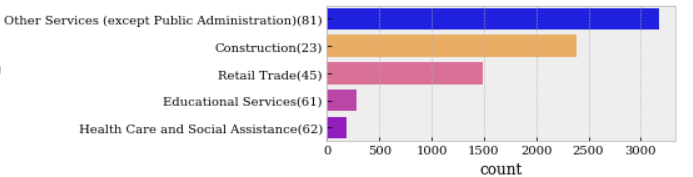
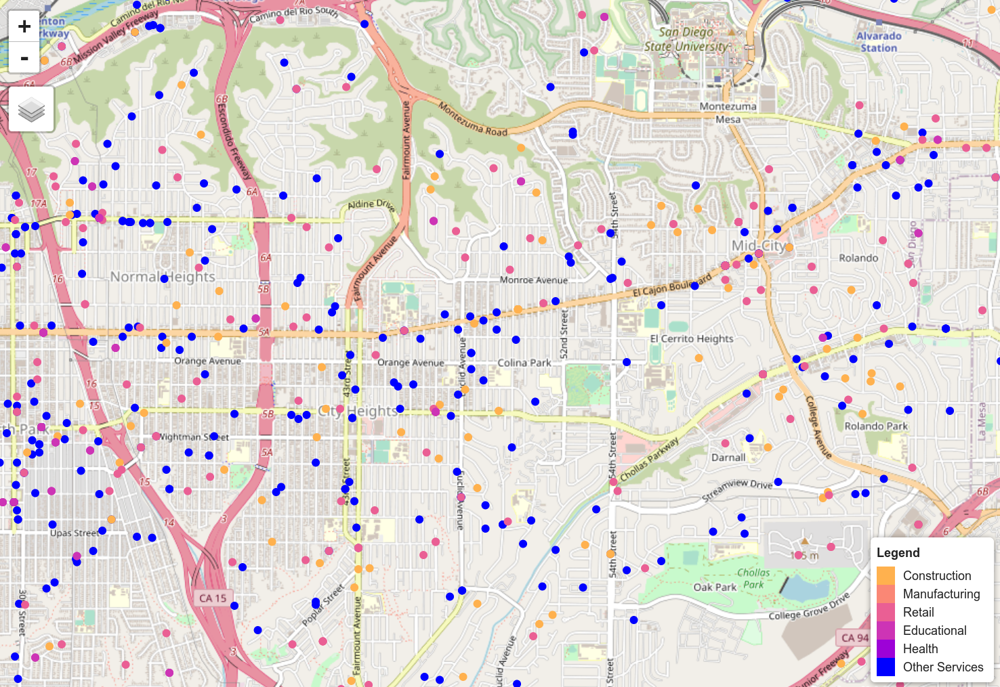
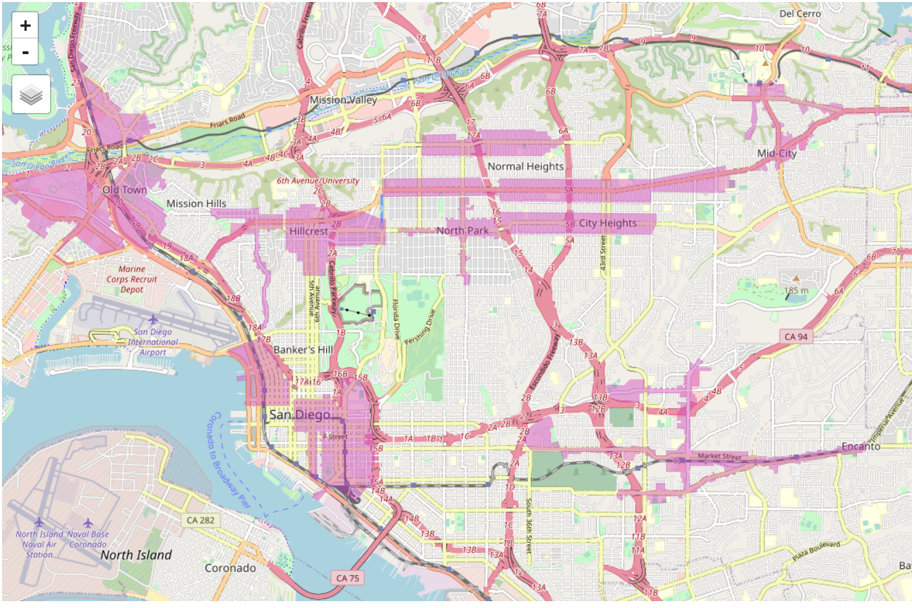
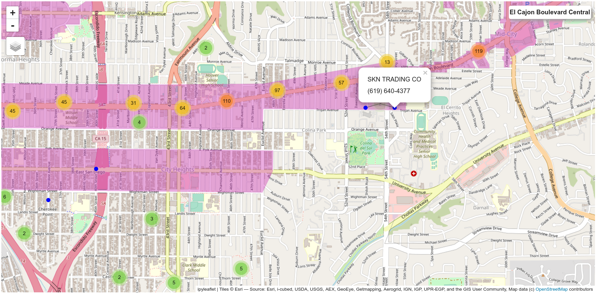

# Initial review of small business data set

[scalesd](https://www.scalesd.com/) is planning an innovation program to understand the impact of small/micro businesses in the urban environment.  They have obtained a dataset of small businesses in San Diego.

This repository is a  collection of notebooks providing a quick look at this data.  They demonstrate an approach to combine different open source information to analyze, filter, query, and visualize the data.

## Initial use cases
Initial **questions** focus on entities: **business type and location**,  localities: **neighorhoods, and Business Improvement Districts** and national/regional areas: **Census, BLS, council districts, and [employment centers](https://www.sandag.org/index.asp?classid=16&subclassid=127&projectid=581&fuseaction=projects.detail)** of San Diego. 

Specific cases to start with:

  1. Clean and analyze the **[scalesd business csv](https://onedrive.live.com/edit.aspx?resid=1E5F39F3051216FA!217&cid=af24648a-ad9d-4a64-91f2-1c89990698c1&ithint=file%2cxlsx&wdOrigin=OFFICECOM-WEB.START.MRU)**.
  2. Geocode business data with **[OSM Nominatim](https://nominatim.openstreetmap.org/ui/search.html)**.
  3. Use shape files from City of SD to filter for different [BID](https://www.sandiego.gov/economic-development/about/bids)s.
  2. [jupyterlab](https://jupyter.org/) and multiple py packages for analysis and visualization.

## Data
The analysis combines multiple sources for **context**.  Specifically: 

  1. Open government polygon data as a foundation.
  2. Business data from `scalesd`.
  3. [osm for geocoding and street networks](https://geoffboeing.com/2016/11/osmnx-python-street-networks/).
  4. [City of SD](https://data.sandiego.gov/) and [sangis](https://sangis.org/download/index.html) for various shape files, specifically the [BID](https://data.sandiego.gov/datasets/business-improvement-districts/) data.

## Tools and Techniques
Tools, techniques, and use cases to discuss at this time:

  1. `jupyterlab` (with a bit of emacs) is my development environment.
  2. `pandas, geopandas, and shapely` for spatial analysis.
  3. `ipyleaflet`, bqplot, and `ipywidgets` for mapping and dashboard development.
  4. `osmnx` for geocoding (via **OSM**).

## Examples

`Starting from Daniel's email:` 
Based on that table, we've identified the following categories (`sector highlighting is mine`): 
Construction - code **23**, **23**3, **23**4 etc. 
Personal care - **81**21 
Health - **62**1 and similar 
restaurants - **31**, **31**1811, **31**212 etc. 
schools and instruction (including fitness and personal training) - **61**, **61**1 
retail (**45**) somehow didn't make it into pivot tables, but I believe it should be there as well - small retail

So, for starters, the `sectors` **we're interested in** are: **23, 31, 45, 61, 62, and 81**.

The **first example** looks at the `business` in our `sectors of interest`.  Very basic stuff!   

  <table>
      <tr> 
        <td >
            <table >
                <tr>Using NAICS codes I filtered the data set to get to something a bit more managable.   The results are summarized in the following count plot.  </tr>
              <tr>
                  <td>
                      

                  </td><tr>
                <tr>
               <td>
                  Overall, as the exploratory system is developed I'm trying to relate statistical and geographic views.
                    <ol>
                      <li>NAICS business categories are used to show counts</li>
                      <li>Counts and map markers have a consistent color palette</li>
                      <li>The map display provides access to underlying data</li>
                    </ol>
              </td>
                </tr>
            </table>
         <td >
          <table >
            <tr>
                <td>
                  
 

                </td>
              </tr>
             </table>

  </table>

    
    
    
    
The **second example** incorporates the Business Improvement Districts (BIDs).  Note I'm using a slightly different technique for the map markers.   It decluters the map as the analysis unfolds.  The `first image` shows the overlay of BID polygons.  BID data was obtained from City of San Diego open data.
    
 

     
 
    
    
    
     
My initial thoughts were to use the geocoded addresses from the business data, the BID polygons, and the point-in-polygon function to determine which businees are in which BID.  I'm not sure that works...
    
The `second image` in this example is a snapshot of the Boulevard BID.  Numbered MarkerClusters show that multiple markers have bee "clustered" to declutter the map.  I selected one of the markers and show the information I'm showing for the business.  There other fields in the record.
    
    

     
 
 

    
## Next Steps
    
    I am working the business questions now.  If anyone wants to hear more let me know!
    
    
## Contents of the repo

- data directory contains the various csv and (geocoded) shape files

- notebooks directory contains the initial notebooks
   - `tranform.ipynb` - primary notebook to process the business csv
   - `query.ipynb` - a scratch pad to play with different queries (more to come on this one)
   - `El Cajon Blvd BID.ipynb` - visualize the boulevard BID

## Notes on the env

I use jupyter lab with ipywidgets and ipyleaflet for my development. It may not be the standard.  I've tried to seperate a base environment with the needed analysis packages.  Anaconda is required with this approach.  This is the way I do it so your mileage may vary.

  1. Assuming anaconda is installed, environment.yml can be used to build a baseline lab env with conda:  `conda env create -f environment.yml`
  
  2. Activate the new env: `conda activate scalesd`
  
  3. Once the python env is done set up the js packages with: `jupyter labextension install @jupyter-widgets/jupyterlab-manager jupyter-leaflet`
  
  4. At this point you will have a working jupyter lab with the necessary widgets.
  
  5. Finally, the requirements.txt file contains the packages used in the analysis.  `pip install -r requirements.txt` will complete the installation.
  
There are of course multiple ways to create this env.  Other approaches for the basic env, map display etc should work.  Basic processing, cleaning, geospatial filter etc. should work with the packages found in requirements.txt